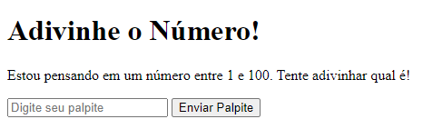

# Projeto de Adivinhação em JavaScript 🎲

Este é um projeto simples de adivinhação em que o jogador tenta adivinhar um número aleatório entre 1 e 100. O projeto consiste em um formulário HTML com um campo de entrada para o palpite do jogador e um botão de envio. O JavaScript é responsável por gerar um número aleatório, verificar o palpite do jogador e fornecer feedback sobre se o palpite está correto, muito alto ou muito baixo.

## Tecnologias Utilizadas 🛠️

- HTML
- CSS
- JavaScript

## Como Jogar 🎮

1. Abra o arquivo `index.html` em seu navegador.
2. Digite um número entre 1 e 100 no campo de entrada.
3. Clique no botão "Enviar Palpite".
4. Você receberá um feedback indicando se seu palpite está correto, muito alto ou muito baixo.
5. Continue adivinhando até acertar o número correto!

## Visualização 🖼️

## Contribuição 🤝

Contribuições são bem-vindas! Se você quiser sugerir melhorias ou resolver problemas, sinta-se à vontade para abrir uma issue ou enviar um pull request.

